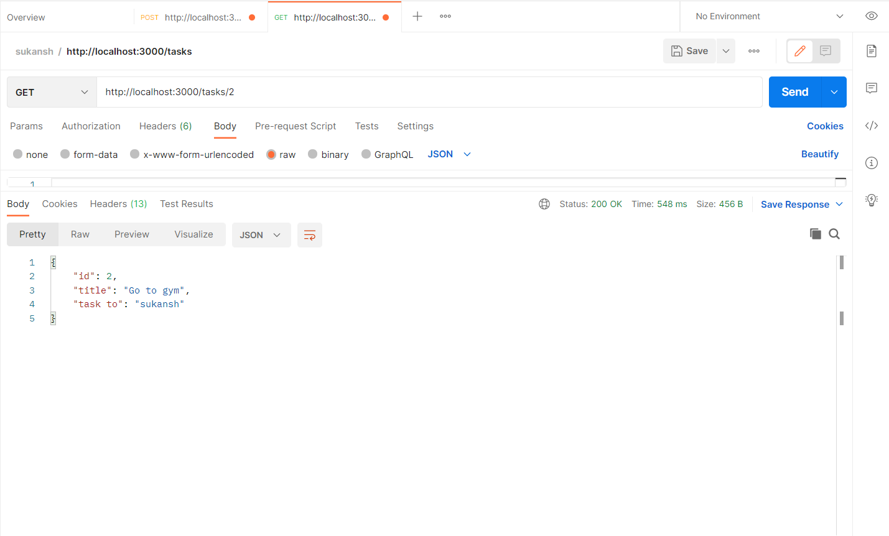
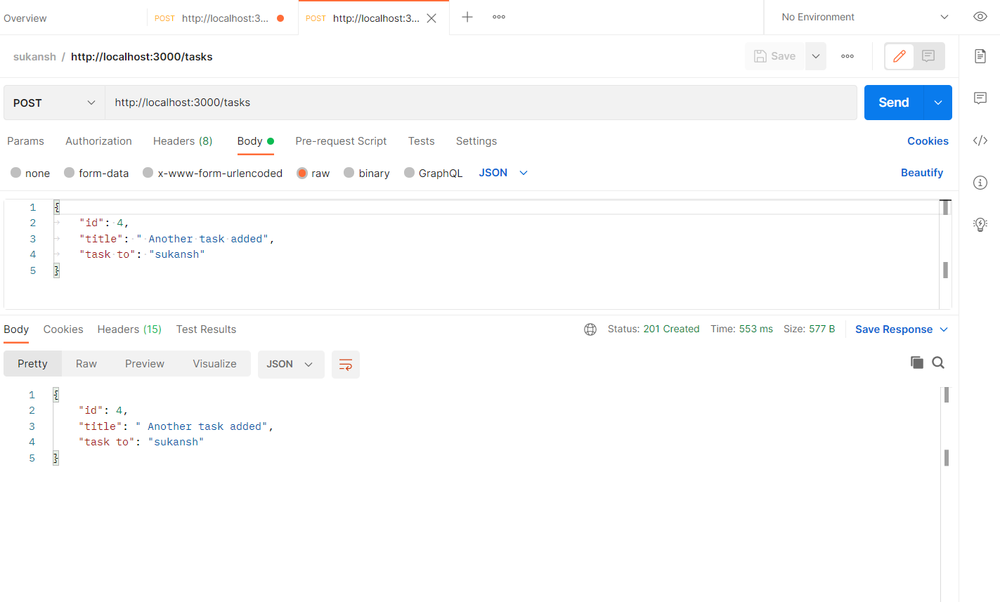
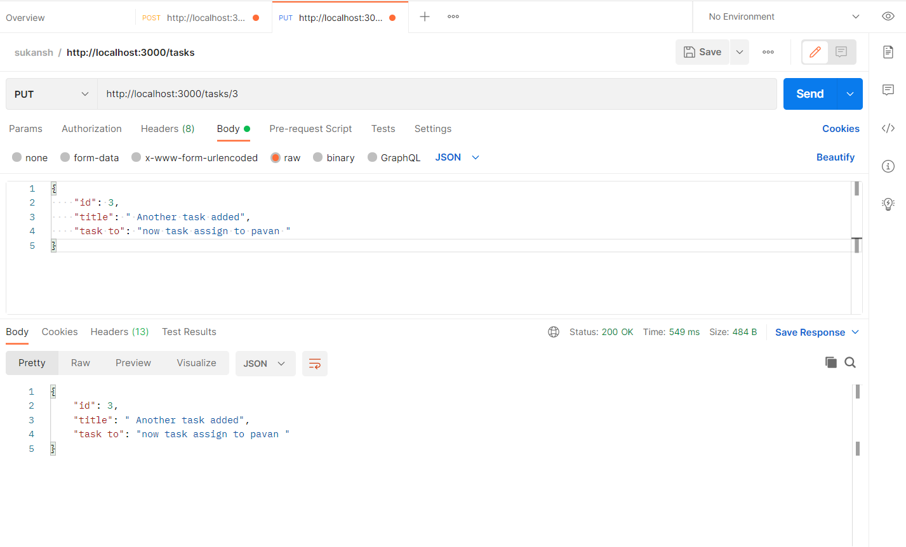
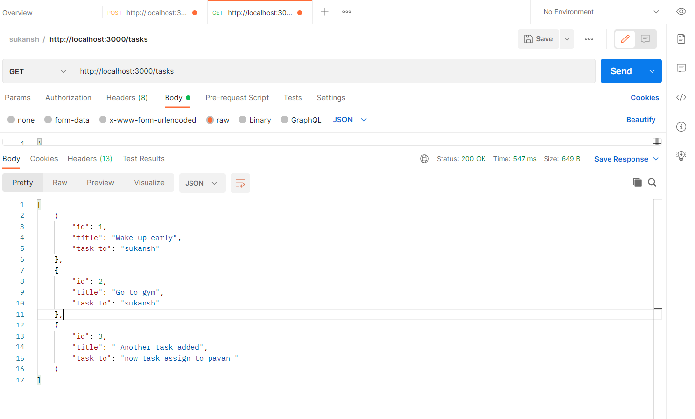
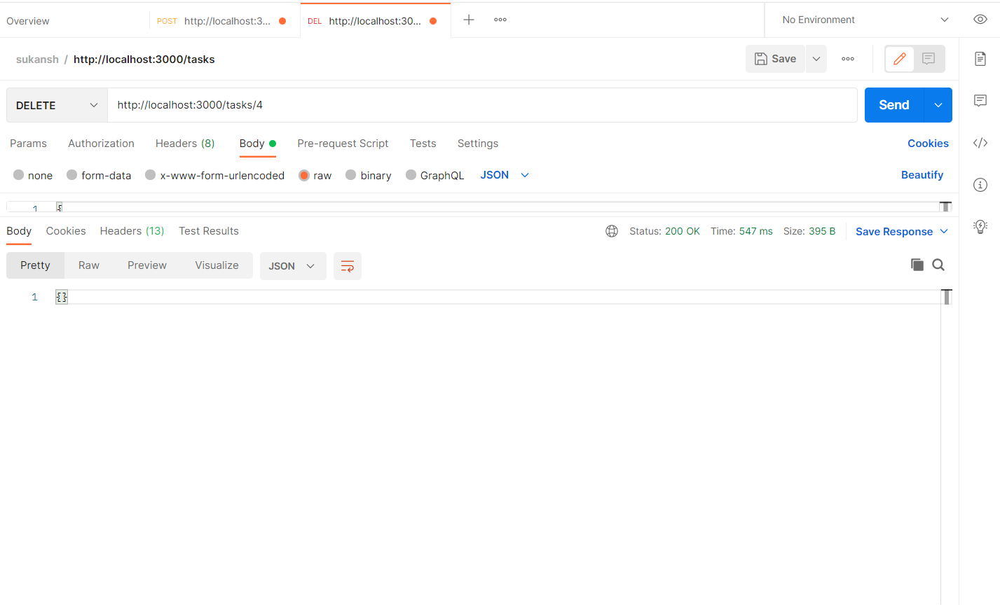

## Getting started

Install JSON Server

```
npm install -g json-server
```

## Creating db.json file

Creating the tasks

```
[
    {
        "id": 1,
        "title": "Wake up early",
        "task to": "sukansh"
    },
    {
        "id": 2,
        "title": "Go to gym",
        "task to": "sukansh"
    },
    {
        "id": 3,
        "title": " Do coding and repeat",
        "task to": "sukansh "
    },

]

```

Start JSON Server

```
json-server --watch db.json
```

Now go to [http://localhost:3000/tasks](http://localhost:3000/tasks)

All created tasks will show here in json format

<p align="center">
  <a href="#" target="_blank">
    
  </a>

</p>

GET https://localhost:3000/tasks for showing all the tasks created


GET https://localhost:3000/tasks/1 will show the perticular which is required whose id is 2 

<p align="center">
  <a href="#" target="_blank">
    
  </a>

</p>

We are creating another task,


POST https://localhost:3000/tasks
another task will be added.
<p align="center">
  <a href="#" target="_blank">
    
  </a>

</p>

Now if we want to change the information in the original tasks 

PUT https://localhost:3000/tasks/4

<p align="center">
  <a href="#" target="_blank">
    
  </a>

</p>

changes will be made as shown

<p align="center">
  <a href="#" target="_blank">
    
  </a>

</p>


Now if we want to delete the task 

DELETE https://localhost:3000/tasks/4

<p align="center">
  <a href="#" target="_blank">
    
  </a>

</p>

changes will be made as shown

<p align="center">
  <a href="#" target="_blank">
    
  </a>

</p>


<p align="center"> Thank you </p>

